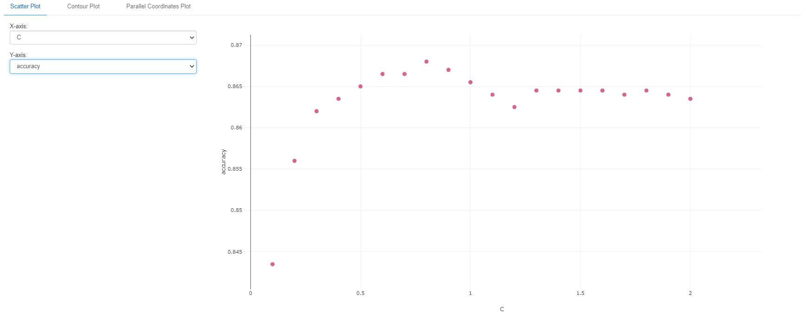
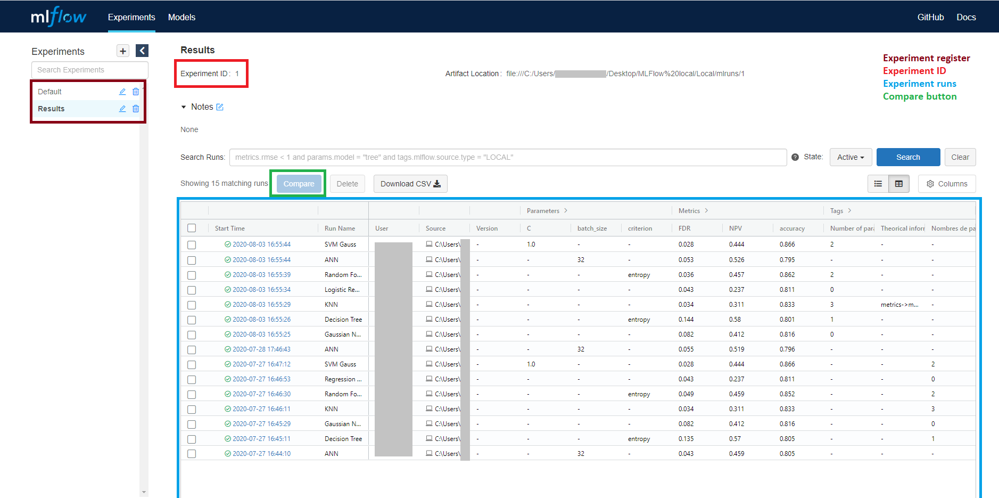
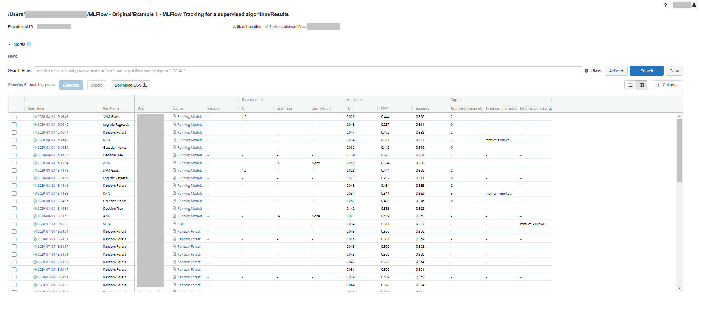

MLFLOW TRACKING POUR UN ALGORITHME SUPERVISÉ
============================================

Objectifs
---------

* **Compréhension de MLFlow Tracking & Model**
* **Implémentation en local et sur Databricks de MLFlow Tracking**
* **Création d'un MLFlow Model (configuration par défaut)**
* **Utilisation de Tracking UI**

Composition du dossier
----------------------

Le dossier est composé de trois dossiers comportant les images de cette section et les notebooks des implémentations en local et sur Databricks et d'un fichier CSV comportant le jeu de données de notre exemple. 

Présentation des composants MLFlow Tracking & Model
---------------------------------------------------

Le composant MLFlow Tracking est à la fois une API et une interface utilisateur. Son but est d'enregistrer des paramètres, métriques, fichiers et informations (rajouter des annotations aussi). Cette enregistrement se réalise pendant le lancement d'une expérience de code Machine Learning. Ce lancement est ensuite stocké dans un répertoire dont la référence est précisée. Le répertoire en question stocke tous nos lancements dans des dossiers. Ces dossiers sont composés de toutes les informations de nos lancements (paramètres, métriques, fichiers ...)  mais également d'un MLFlow Model. De plus, grâce à l'interface utilisateur de MLFlow Tracking, nous pouvons visualiser ces informations et comparer leurs résultats entre eux. L'interface utilisateur s'appelle Tracking UI.

Le composant MLFlow Model est un format standard pour packager des modèles ML. Il permet de déployer un modèle sur diverses plateformes et/ou services numériques. Plus précisément, il définit une convention qui permet de sauvegarder un modèle dans différentes "*flavors*". La génération d'un MlFlow Model est réalisé de deux manières, soit :
* il est définit par un MLFlow Project : la configuration de l'environnement (versions de Python, des bibliothéques, des installations ...) est décrite dans ce dernier (nous verrons cela dans l'exemple 3)
* il n'est pas définit par un MLFlow Project : la configuration de l'environnement est la même que l'environnement du lancement de l'expérience

Visualisation des expériences et accès au Tracking UI
-----------------------------------------------------

La visualisation des résultats se réalise sur l'interface utilisateur de MLFlow : Tracking UI. On peut visualiser des paramètres, des métriques et des fichiers ou encore comparer ces derniers grâce à celui-ci. Le but principal de cet outil est de nous aider à choisir un modèle performant. Par exemple, si on souhaite que notre modèle soit un classifieur SVM, on peut réaliser plusieurs lancements d'expérience avec différents paramètres afin d'optimiser une métrique (accuracy, sensibilité, spécificité ...) et comparer cette métrique par rapport aux paramètres d'entrée sur l'interface.

**Accès au Tracking UI en local**

0. Lancer vos expériences. Un dossier intitulé `mlruns` (ce nouveau dossier contient les répertoires de vos expériences) a été créé dans votre dossier, il contient vos scripts Python.
1. Ouvrir un invite de commande/terminal.
2. Se déplacer jusqu'au dossier des scripts Python à l'aide de la commande `cd`.
3. Taper sur l'invite de commande/terminal `mlflow ui`.
   * Si un message d'erreur apparaît précisant que la commande `mlflow` n'est pas reconnu comme un exécutable, cela signifie que vous n'avez pas configuré une variable d'environnement pour MLFlow. Je vous recommande de (re)lire le fichier [`README.md`](https://github.com/StevanStanovic/mlflow/blob/master/README.md) de la racine du dépôt.
   * Sinon, un message vous informe que Tracking UI a été lancé sur une adresse Internet local.
4. Ne pas fermer l'invite de commande/terminal, ouvrir son navigateur web et copier-coller l'adresse web ou alors taper http://localhost:5000/ (cela revient normalement au même)
5. L'interface Tracking UI apparaît.

Pour plus d'informations, je vous recommande le [tutoriel](https://www.mlflow.org/docs/latest/quickstart.html#quickstart) de la documentation de MLFlow.

**Accès au Tracking UI sur Databricks**

0. Créer un fichier expérience MLFlow `Mlflow Experiment`, cliquer sur le fichier et récupérer la référence de l'ID expérience (`Experiment ID`).
1. Lancer vos expériences.
2. Retourner dans le fichier expérience MLFlow et visualiser votre répertoire d'expérience.

Présentation du jeu de données
------------------------------

Le jeu de données se nomme Churn Modelling, ce qui signifie en français Modélisation d'attrition. L'attrition désigne le fait de perdre des clients. Ici, dans notre exemple, le fait de perdre des clients dans une banque se situant dans trois pays : France, Allemagne et Espagne. L'objectif de ce jeu de données est de prédire si le prochain client va partir ou non.

Le jeu de données se compose de 14 variables :
* **RowNumber** : Numéro de ligne (inutile pour l'implémentation)
* **CustomerID** : Numéro de client (inutile pour l'implémentation)
* **Surname** :  Nom de famille (inutile pour l'implémentation)
* **CreditScore** : Score bancaire (entier)
* **Geography** : Pays du client (variable catégorielle non ordinale)
* **Gender** : Sexe du client (variable binaire)
* **Age** : Age du client (entier)
* **Tenure** : Nombre d'années dans la banque (entier)
* **Balance** : Disponibilité de fonds (réel)
* **NumOfProducts** : Nombre de produits (entier)
* **HasCrCard** : Possession d'une carte bancaire (variable binaire)
* **IsActiveMember** : Membre actif (variable binaire)
* **EstimatedSalary** : Estimation du salaire (réel)
* **Exited** : Attrition du client (variable binaire, *cible de la prédiction*)

Implémentation
--------------

L'implémentation de base de l'exemple présenté dans cette section se compose de sept modèles :
* Réseau de neurones artificiels (ANN)
* Arbre de décision (Decision Tree)
* Classifieur naîf bayésien (Gaussian Naive Bayes)
* K-plus proches voisins (KNN)
* Régression logistique (Logistic Regression)
* Forêt d'arbres décisionnels (Random Forest)
* Classifieur à vecteurs de support (SVM Gauss)

Chaque modèle possède la même structure :
1. Fonction pour l'importation des modules Python nécessaires
2. Fonction pour l'importation des données avec pré-traitement inclus
3. Fonction pour l'exécution d'une expérience MLFlow
4. Lancement de l'expérience dans la partie principale du script

*Remarque : pour l'ANN, il existe en plus une autre fonction qui permet de construire le réseau de neurones.*

***Remarque importante :** ne pas oublier de changer le chemin d'accès au jeu de données et de fixer l'ID de l'expérience.* 

Implémentation en local
-----------------------

Les deux particularités notables sont que l'on régle la variable TRACKING URI dans le dossier local et que, si besoin, on doit créer une expérience dans le script.

Comme expliqué plus haut dans ce document, il faut que vos scripts Python se trouve dans le même dossier puis exécutez-les et ouvrez le Tracking UI.

Implémentation sur Databricks
-----------------------------

Pas de particularité au niveau des scripts. Ces derniers ne sont pas obligatoirement dans le même dossier car la référence de l'ID de l'expérience est suffissante. Ne pas oublier de le créer cependant.
