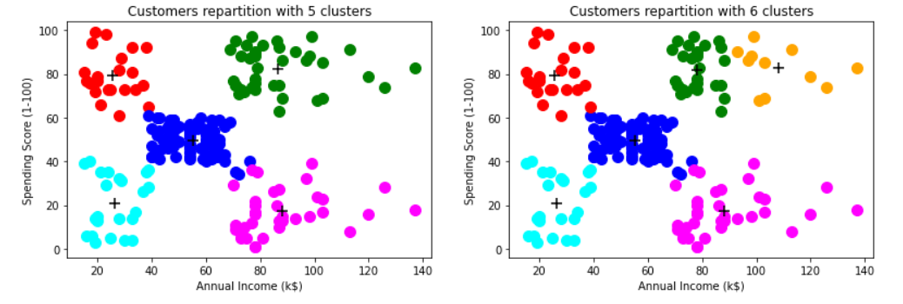

MLFLOW TRACKING POUR UN ALGORITHME NON SUPERVISÉ
================================================

Objectifs
---------

* **Compréhension de MLFlow Tracking & Model**
* **Implémentation en local et sur Databricks de MLFlow Tracking**
* **Création d'un MLFlow Model (configuration par défaut)**
* **Utilisation de Tracking UI**

Composition du dossier
----------------------

Le dossier est composé de trois dossiers comportant les images de cette section et le notebook des implémentations en local et sur Databricks et d'un fichier CSV comportant le jeu de données de notre exemple.

Présentation des composants MLFlow Tracking & Model et du Tracking UI
---------------------------------------------------------------------

Pour plus d'informations, je vous recommande de vous référer au [`README.md`](https://github.com/StevanStanovic/mlflow/blob/master/1%20-%20MLFlow%20Tracking%20pour%20un%20algorithme%20supervis%C3%A9/README.md) du premier exemple.

Présentation du jeu de données
------------------------------

Le jeu de données se nomme Mall Customers. Il répertorie 200 clients d'un magasin. Après avoir récupéré des données sur ces derniers, le magasin en question a attribué à chaque client un score de dépense selon les achats effectués. L'objectif de ce jeu de données est de le partionner afin de trouver des groupes d'individus se ressemblant.

Le jeu de données se compose de 5 variables :
* **CustomerID** : Numéro de client (inutile pour l'implémentation)
* **Genre** : Sexe du client (variable binaire)
* **Age** : Age du client (entier)
* **Annual Income (k$)** : Estimation du salaire en milliers de dollar (entier)
* **Spending Score (1-100)** : Score de dépense (entier compris entre 1 et 100)

Implémentation
--------------

L'implémentation de base de l'exemple présenté dans cette section se compose d'un seul script qui va générer dix-neuf modèles K-Means. La seule différence entre ces modèles repose sur le nombre de clusters a formé. Ce nombre varie de deux à vingt.

Le script est construit de la manière suivante :
1. Importation des modules Python nécessaires
2. Fonction pour l'importation des données avec pré-traitement inclus
3. Fonction pour l'exécution d'une expérience MLFlow
4. Lancement de dix-neuf expériences à l'aide d'une boucle dans la partie principale du script

***Remarque importante :** ne pas oublier de changer le chemin d'accès au jeu de données et de fixer l'ID de l'expérience.* 

Implémentation en local et sur Databricks
-----------------------------------------

Même particularité que dans le [`README.md`](https://github.com/StevanStanovic/mlflow/blob/master/1%20-%20MLFlow%20Tracking%20pour%20un%20algorithme%20supervis%C3%A9/README.md) du premier exemple.

Résultats
---------

Le jeu de données est bien connu du grand public. Normalement, on décide de partionner le jeu de données en cinq groupes. Cependant, en comparant les métriques obtenues pour les dix-neuf partitonnements, on trouve que le nombre optimum de clusters est six.

Cette différence provient tout simplement de l'interprétation de la méthode de coude (voir [Elbow method](https://en.wikipedia.org/wiki/Elbow_method_(clustering)) pour plus d'informations). Cependant, les indices Davies-Bouldin, Calinski-Harabasz et de la silhouette du cluster nous recommandent de choisir une partition de six groupes.

La seule différence réelle entre les deux choix est que, parmi le groupe de clients ayant des revenus et un score élevés, il existe deux sous-groupes :
* l'un avec des revenus annuels dépassant 100 000$ globalement
* l'autre avec des revenus annuels maximum de 90 000$

