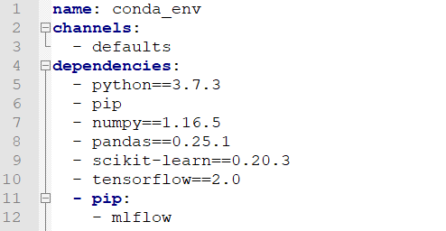
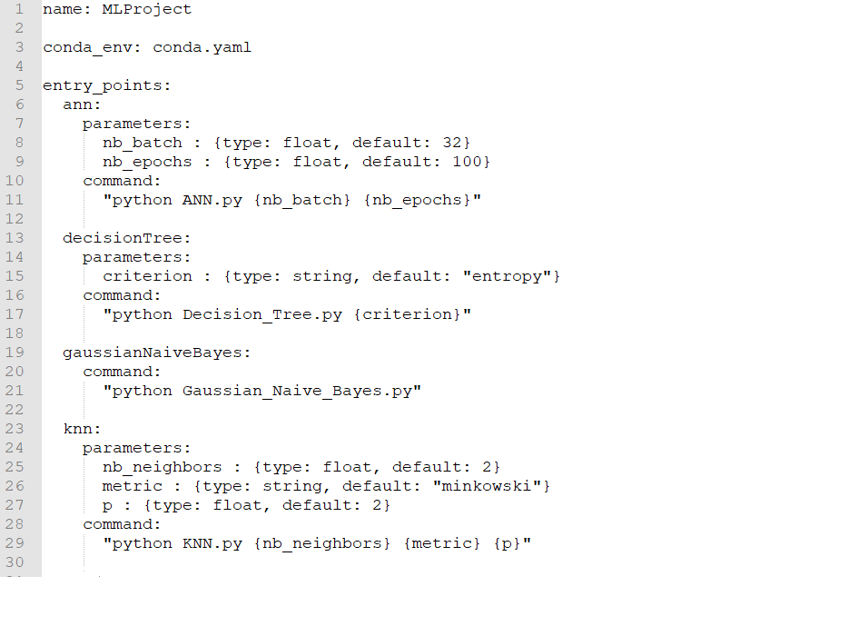

MLFlow Project à l'aide d'un référentiel Git et prédiction de nouvelles instances
=================================================================================

Objectifs
---------

* **Compréhension de MLFlow Project**
* **Configuration de l'environnement du MLFlow Model**
* **Execution en local et sur Databricks d'un MLProject à l'aide d'un référentiel GitHub ou GitLab**
* **Prédiction de nouvelles instances**

Composition du dossier
----------------------

Le dossier est composé de deux dossiers comportant d'une part les notebooks Databricks et d'une autre les commandes MLFlow a éxecuté sur l'invite de commande/terminal (fichiers texte). 

Les référentiels GitHub et GitLab de cet exemple se trouve respectivement aux adresses suivantes : [GitHub](https://github.com/StevanStanovic/mlflow/tree/master/MLFlowProject) et [GitLab](https://gitlab.com/stevan.stanovic/mlflow).

Pour la partie prédiction de nouvelles instances, la seconde partie des notebooks Databricks peuvent être réutilisés pour une implémentation locale.

Présentation du composant MLFlow Projects
-----------------------------------------

Le composant MLFlow Projects est un format pour packager du code ML afin de pouvoir le réutiliser et reproduire les mêmes résultats à tout moment. Cela est rendu possible à l'aide de certaines conventions, elles permettent d'organiser et de décrire son code afin de permettre à d'autres utilisateurs de l'exécuter.

Chaque MLFlow Project est simplement un répertoire de fichiers ou un référentiel Git contenant le code. En plus de ce code, un fichier nommé MLproject est présent, c'est la description de notre MLFlow Project. Celui-ci est souvent relié à un autre fichier décrivant l'environnement dans lequel les codes ML vont être exécutés. Ce fichier peut être une description d'un environnement Conda en format YAML ou une image Docker.

En outre, le fichier MLproject possède trois sections :
* **Name** : le nom du projet
* **Entry Points** : les points d'entrées, ce sont des commandes permettant de lancer des exécutables Python ou Shell, on peut préciser si besoin des paramètres (paramètrages par défauts possible)
* **Environnement** : environnement du projet, comme expliqué plus haut, il est décrit soit dans un fichier YAML (environnement Conda unquement) ou soit dans une image Docker

**Description d'un environnement Conda dans un fichier YAML**

**Exemple d'un fichier MLproject**

Pour plus d'informations sur les MLFlow Project, vous pouvez vous référer à la documentation de MLFlow ou de Databricks :
   * [Documentation MLFlow](https://www.mlflow.org/docs/latest/projects.html)
   * [Documentation Databricks](https://docs.databricks.com/applications/mlflow/projects.html)

Présentation du jeu de données
------------------------------

Le jeu de données est le même que pour celui de l'exmeple 1. Je vous invite à vous référer au [`README.md`](https://github.com/StevanStanovic/mlflow/blob/master/1%20-%20MLFlow%20Tracking%20pour%20un%20algorithme%20supervis%C3%A9/README.md) de ce dernier.

Implémentation
--------------

Implémentation en local
-----------------------

Implémentation sur Databricks
-----------------------------
