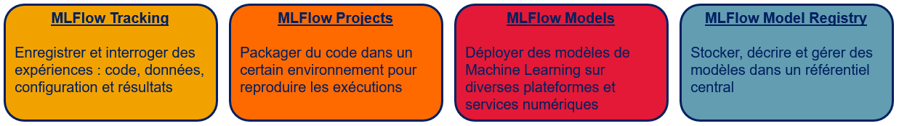
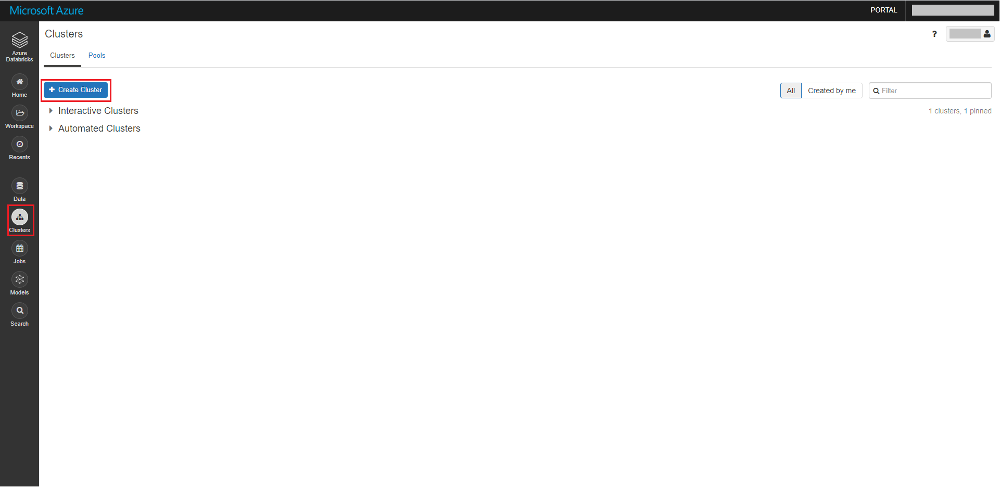
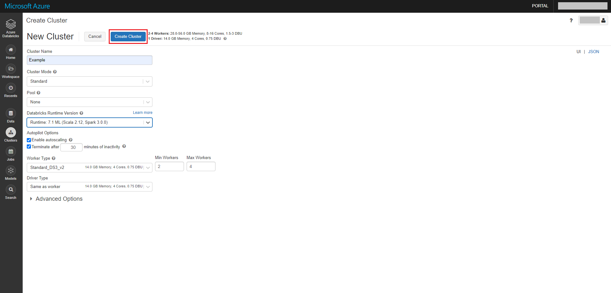
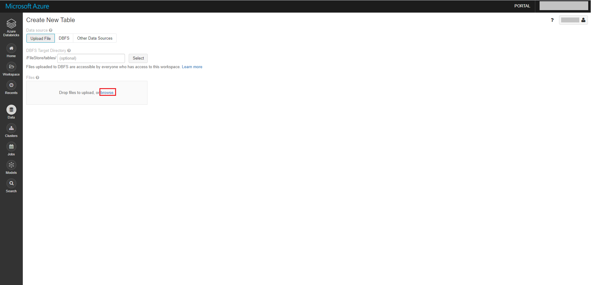
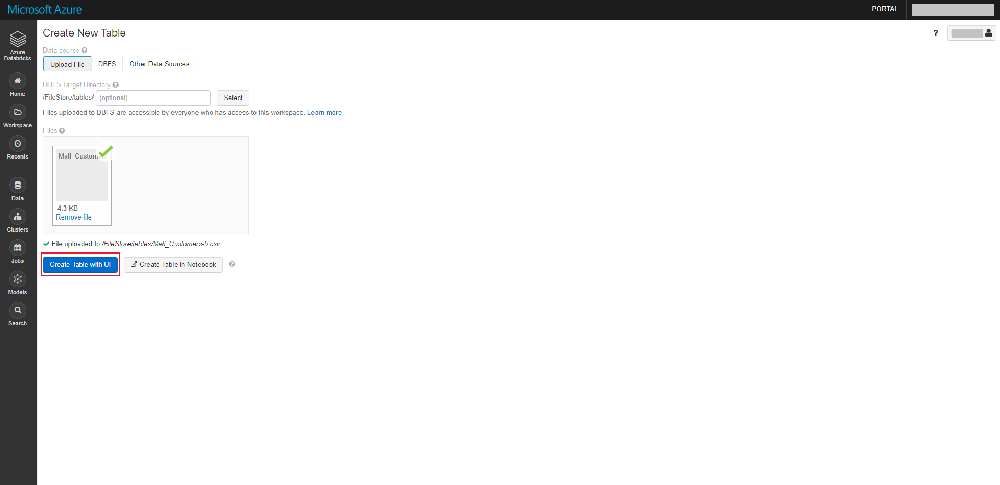
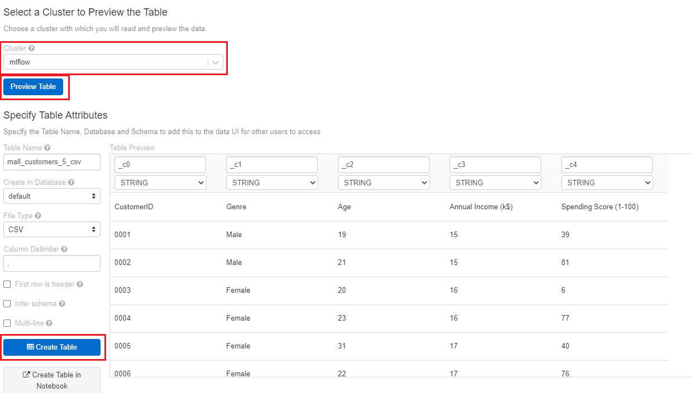
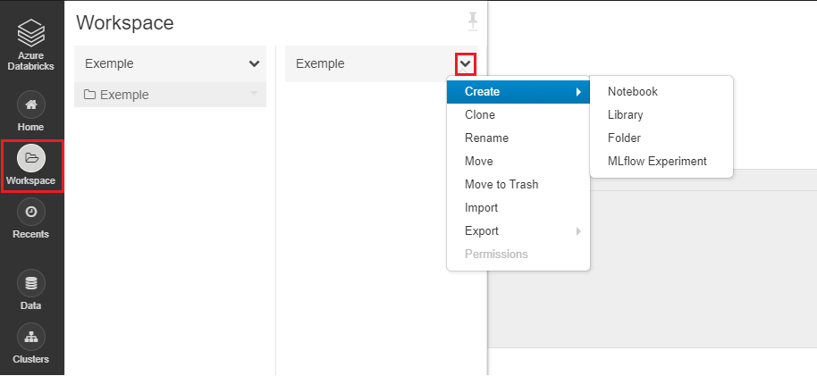

MLFLOW
======

Présentation de MLFlow
----------------------

[MLFlow](https://www.mlflow.org/) est une plateforme open source pour la gestion du cycle de vie du Machine Learning (ML). Cette plateforme est une adaptation d'un concept appelé **MLOps** issu d'une publication scientifique de 2015 intitulée [*Hidden Technical Debt in Machine Learning Systems*](http://papers.nips.cc/paper/5656-hidden-technical-debt-in-machine-learning-systems.pdf).

Créé en Juin 2018, MLFlow est un projet initié par Databricks afin de faciliter le cycle de vie d'une solution d'Intelligence Artificielle (IA). Plus précisément, l'objectif principal est de standardiser les outils de ML pour :
 * **suivre des expériences :** choix des meilleurs paramètres de nos divers modèles ML
 * **reproduire des résultats :** création d'environnement de développement identique pour chaque utilisateur/collaborateur
 * **déployer des modèles :** standardisation de la procédure de déploiement

Cet objectif a été atteint depuis et des améliorations ont été développées comme le déploiement d'un modèle sur d'autres plateformes ou encore la facilité de gérer l'état d'avancement d'un modèle en production. MLFlow est donc une bonne solution pour aider les développeurs et les opérationnels d'une entreprise à industrialiser leurs modèles et gérer la vie de leurs algorithmes. 

Aujourd'hui, MLFlow est réparti en quatre composants principales :

Objectifs de ce dépôt GitHub
----------------------------

 * **Compréhension des quatre composants principales**
 * **Découverte de Tracking UI**
 * **Implémentation et utilisation de MLFlow en Python**
 * **Découverte de MLFlow dans deux environnements de développement :**
   * **Développement local**
   * **Développement sur Databricks**

Composition du dépôt GitHub
---------------------------

Le dépôt est constitué de quatre dossiers représentant chacun un exemple de l'utilisation de :
 1. MLFlow Tracking pour un algorithme supervisé (classification)
 2. MLFlow Tracking pour un algorithme non-supervisé (clustering/partitionnement des données)
 3. MLFlow Project à l'aide d'un référentiel Git
 4. MLFlow Model Registry et déploiement d'un algorithme sur Azure Machine Learning (AML)

Pour chaque dossier, il y a au moins deux dossiers correspondant aux deux manières présentées de coder un MLFlow dans ce dépôt (Local ou Databricks) et un fichier Databricks (.dbc) pour faciliter le téléchargement des personnes possédant un compte Databricks.

*Remarque : le dossier `MLProject` est un dossier lié à l'exemple 3.*

Pré-requis pour le développement en local
-----------------------------------------

Tout d'abord, il faut installer Python. Deux choix s'offrent à vous :
 * télécharger et installer Python depuis le [site officiel Python](https://www.python.org/downloads/)
 * télécharger et installer Anaconda depuis le [site officiel Anaconda](https://www.anaconda.com/products/individual)
 
Dans tous les cas, afin de suivre les quatre exemples, il vous faudra télécharger les bibliothèques Python suivantes : 
 * **numpy**
 * **pandas**
 * **scikit-learn** (sklearn)
 * **tensorflow**
 * **mlflow**

**Remarques importantes :** 
 * Durant l'installation, il est recommandé de créer la variable d'environnement associé au chemin d'accès (**PATH**) du Python installé. De même, lorsque vous installerez des bibliothèques des avertissements (**Warnings**) apparaîtront par rapport à la non-présence d'une variable d'environnement. Si vous devez effectuer cette tâche après installation, les liens Youtube suivants vous permettront de faire cela (ou d'adapter à votre cas si besoin)
   * [Configurer votre variable d'environnement avec Windows](https://www.youtube.com/watch?v=M2BWTJXDJXY)
   * [Configurer votre variable d'environnement avec Linux/Mac](https://www.youtube.com/watch?v=NvAYH5Qu_YQ)
 * Configurer/modifier une variable d'environnement est une tâche importante pour utiliser MLFlow localement car nous aurons besoin d'un invite de commande/terminal pour les exemples cités ci-dessus
 * Si vous effectuez un ajout/modification de variable d'environnement, redémarrer votre invite de commande/terminal afin d'avoir accès à ce changement.

L'installation des bibliothèques se réalise de la manière suivante :
  1. Ouvrir un invite de commande/terminal
  2. Installer la bibliothèque `nom_bibliothèque` grâce à la commande : 
     * `pip install --user --upgrade nom_bibliothèque` pour ceux ayant installer Python 
     * `conda install --user --upgrade nom_bibliothèque` pour ceux ayant installer Anaconda

Pour plus d'informations sur comment installer une bibliothèque, je recommande les liens ci-dessous : 
* https://docs.python.org/fr/3.6/installing/index.html pour Python
* https://conda.io/projects/conda/en/latest/user-guide/tasks/manage-pkgs.html pour Anaconda

Pré-requis pour le développement sur Databricks
-----------------------------------------------

Dans cette partie, les quatre choses à savoir sont :
* Comment créer un compte ?
* Comment créer et utiliser un cluster ?
* Comment importer un fichier csv ou json ?
* Quels types de fichier pouvons-nous créer et quelles utilités ont-ils ?

**Comment créer un compte ?**

Afin de créer un compte (sauf si vous en avez un), Databricks propose un essai de quatorze jours (un compte AWS est cependant nécessaire). Afin d'en bénéficier, cliquez sur ce [lien](https://docs.databricks.com/getting-started/try-databricks.html#). Sinon, vous pouvez toujours vous abonner à la version communautaire.

**Comment créer et utiliser un cluster ?**

Dans le but de créer un cluster, vous devez tout d'abord :
1. Vous connecter à votre compte Databricks et ensuite, cliquer sur `Clusters` dans la barre des tâches

2. Cliquer sur `Create Cluster`

3. Complèter les champs pour configurer votre nouveau cluster : donner lui un nom, préciser la version d'exécution et configurer le type de la puissance de calcul ainsi que le nombre de ces derniers. Cliquer sur `Create Cluster` pour finir 
Ci-dessous un exemple de configuration :

4. Après la création du cluster, si vous souhaitez allumer ou éteindre celui-ci, retourner dans la brique `Clusters` dans la barre des tâches. Votre cluster se trouve dans la partie `Interactive Clusters`, cliquer dessus et, selon votre souhait d'action, cliquer soit sur `Start` soit sur `Terminate`.

*Remarques :*
* Pour la version d'exécution du cluster, une version ML classique (pas de GPU) est suffisante pour les exemples de ce dépôt. Il permet d'avoir toutes les bibliothèques Machine Learning dont nous avons besoin (Pandas, Numpy, Scikit-learn, MLFlow). Pour plus d'informations, ce [lien](https://docs.databricks.com/runtime/index.html) vous permettra de vous renseigner sur les différentes versions
* Le choix d'un `Standard_DS3_V2` est suffisant pour de la puissance de calcul dans les exemples du dépôt
* Si vous désirez en apprendre d'avantage sur la configuration d'un cluster, vous pouvez cliquer sur la documentation Databricks [ici](https://docs.databricks.com/clusters/configure.html).

**Comment importer un fichier csv ou json ?**

Pour importer un fichier depuis votre ordinateur personnel, il faut :
1. Cliquer sur `Data` dans la barre de tâches puis sur `Add Data` et `browse` et choisir son fichier

2. Après avoir importer votre fichier, cliquer sur `Create Table with UI`

3. Choisir un cluster, cliquer sur `Preview Table` puis `Create Table`

4. La table créée est alors stocké sur votre compte Databricks.

*Remarque :* Databricks est sensible à la façon dont est écrit le fichier csv ou json, c'est-à-dire, lors de la création de la table, Databricks attend que la ligne implémentée dans le fichier importé corresponde parfaitement à une ligne de sa table. Par exemple, dans l'exemple de MLFlow Project avec un référentiel Git, le descriptif du cluster devra être exactement sur une seule ligne.

**Quels types de fichier pouvons-nous créer et quelles utilités ont-ils ?**

En naviguant dans la barre de tâches de Databricks et en cliquant sur `Workspace`, nous avons la possibilité de créer des fichiers ou dossiers. Pour ce faire, on clique sur la flèche du menu déroulant du dossier et, enfin, on clique sur `Create`.

On remarque sur l'image ci-dessus que l'on peut soit créer : 
* un notebook pour écrire nos scripts
* une bibliothèque (Library) pour importer une bibliothèque dans un dossier (inutile dans ce dépôt)
* un dossier
* une expérience MLFlow pour capter toutes les informations, métriques, paramètres de nos exécutions Python que nous verrons dans les exemples.
