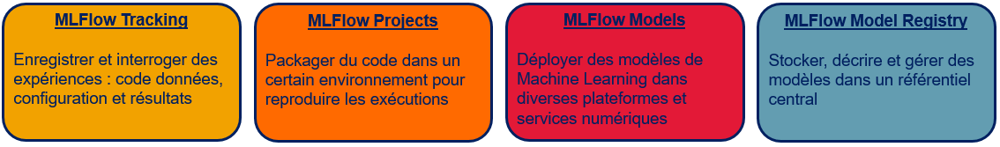

MLFLOW
===========

Présentation de MLFlow
-----------

[MLFlow](https://www.mlflow.org/) est une plateforme open source pour la gestion du cycle de vie du Machine Learning (ML). Cette plateforme est une adaptation d'un concept appelé **MLOps** issu d'une publication scientifique de 2015 intitulée [*Hidden Technical Debt in Machine Learning Systems*](http://papers.nips.cc/paper/5656-hidden-technical-debt-in-machine-learning-systems.pdf).

Créé en Juin 2018, MLFlow est un projet initié par Databricks afin de faciliter le cycle de vie d'une solution d'Intelligence Artificielle (IA). Plus précisément, l'objectif principal est de standardiser les outils de ML pour :
 * **suivre des expériences :** choix des meilleurs paramètres de nos divers modèles ML
 * **reproduire des résultats :** création d'environnement de développement identique pour chaque utilisateur/collaborateur
 * **déployer des modèles :** standardisation de la procédure de déploiement

Cet objectif a été atteint depuis et des améliorations ont été développées comme le déploiement d'un modèle sur d'autres plateformes ou encore la facilité de gérer l'état d'avancement d'un modèle en production. MLFlow est donc une bonne solution pour aider les développeurs et les opérationnels d'une entreprise à industrialiser leurs modèles et gérer la vie de leurs algorithmes. 

Aujourd'hui, MLFlow est réparti en quatre composants principales :

Présentation de MLFlow
-----------
